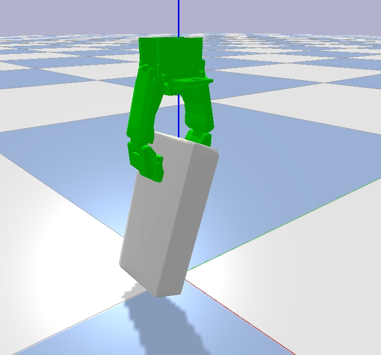

# hsr_hand_simulation

The physical simulation for the hand of HSR Robot (Sasha)
Physics engine: bullet physics (pybullet api)

###  Requirements
1. pybullet (pip install pybullet)
2. numpy
3. opengl
   

### Description of this project
This project will simulate the grasp pose of various objects in a virtual world.


I was so impressed by this paper and the simulation performed in the paper.
6-DOF GraspNet: Variational Grasp Generation for Object Manipulation, Mousavian et al., ICCV 2019.

In the video, multple grippers are spawned to test grasp poses.
[Video](https://research.nvidia.com/sites/default/files/pubs/2019-10_6-DOF-GraspNet%3A-Variational/supplementary_video.mp4 "[Video]") 
[Paper](https://arxiv.org/abs/1905.10520 "[Paper]")

I decided to build a similar environment. Instead of FLEX simulation used in the paper, this one uses more common physics engien, bullet.

The URDF file for the gripper used in the gazebo simulation is modified to work properly with bullet engine. However, some parameters such as spring properties of the gripper are not optimized. Therefore, this is still "unreal" simulation, but hopefully able to suggest possible way to grasp objects.

The gripper will be fixed vertically while objects can be placed arbitrary poses. Thus, the relative pose between an object and the hand is measured and saved with grasp annotation (whether it was a successful grap or a failure)

Current implementation:
- test_pybullet.py: simple grasp simulation using the hand of HSR robot
  - Procedure:  
    1) An object is placed in an arbitrary pose using fixed joint constraints with very small force. Therefore, the object can be slightly movable while closing the gripper
    2)  Grasp the object
    3)  Lifting up the gripper, the constraints for the object is no longer valid. Thus, the object will drop to the ground when the grasp pose is bad. 

- Execution:
  - ``$python test_pybullet.py`` 


**Note**:
In generall, the bullet automatically builds the convex hull for the entire object which causes very different behaviors of objects that has concave shapes or holes (e.g., mugs, can). Hence, the model has to be seperated to multiple convex hulls using vhacd tools.  

To do this, you have to compile vhacd in the bullet3 code as follows,
```
git clone https://github.com/bulletphysics/bullet3
cd bullet3/build3
./premake4_osx gmake
cd gmake
make test_vhacd
../../bin/test_vhacd_gmake_x64_release --input [model.obj] --output [output.obj]
```

Further plans:
1. For this simulation
   - Optimization of parameters: very challenging... stay at the local optimum.
   - Spwan multiple grippers and objects to simulate multiple grasp poses simultaneously.
   - Annotate grasp poses
   - Integrate with a pose estimator (Pix2Pose) to grasp an object based on successful grasp poses. 

2. Other tools to be developed
   - Manual grasp pose annotation with verification using this simulation engine. GUI has to be made to manipulate the gripper and objects easily. 